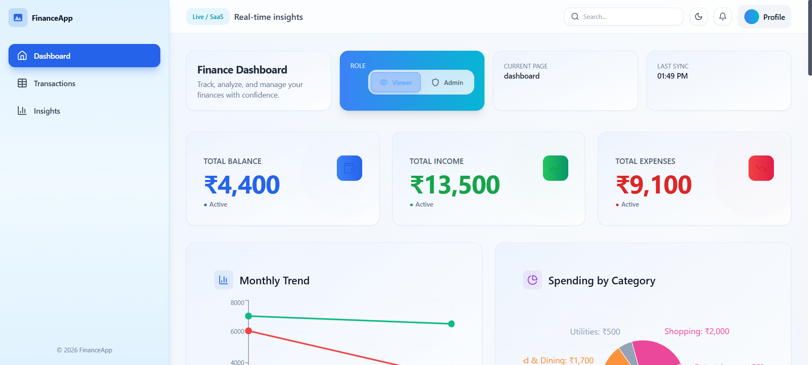
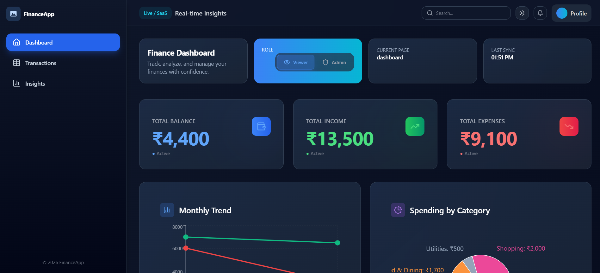
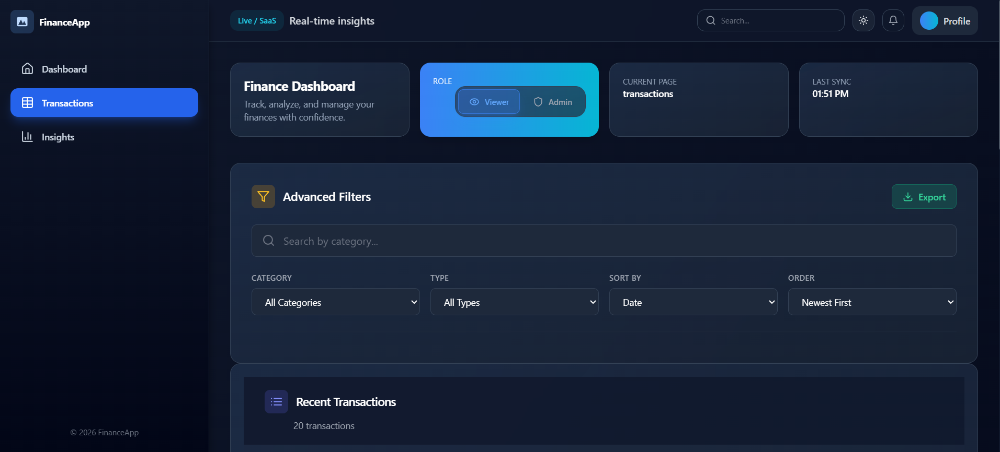
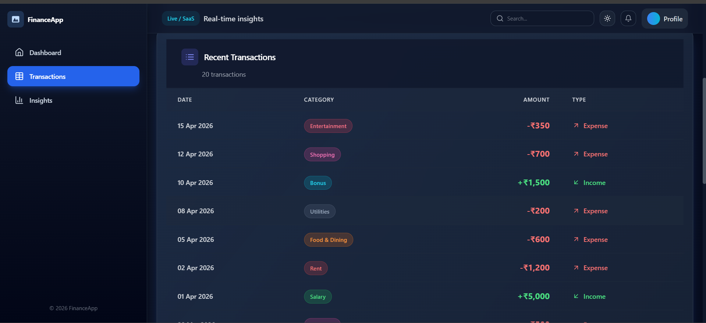

# 💰 Zorvyn Finance Dashboard

A modern, production-ready financial dashboard built with React, featuring advanced analytics, transaction management, real-time charts, and role-based access control with beautiful light/dark mode support.

---

## ✨ Features

### 📊 Dashboard Analytics
- **Real-time Financial Metrics** - Net Worth, Total Income, Total Expenses, Savings Rate
- **Interactive Charts** - Line charts for trends, pie charts for expense breakdown
- **Responsive Summary Cards** - Quick overview of key financial metrics with gradient backgrounds

### 💳 Transaction Management
- **Add/Edit Transactions** - Modal form with category selection and date picker
- **Advanced Filtering** - Filter by date range, category, type (income/expense)
- **Search Functionality** - Full-text search across transaction descriptions
- **Sort Options** - Sort by date, amount, or category
- **Export Data** - Export filtered transactions as CSV for analysis

### 🔐 Role-Based Access
- **Viewer Mode** - Read-only access to dashboard and analytics
- **Admin Mode** - Full access to add, edit, and delete transactions
- **Persistent Roles** - Role preference saved to localStorage

### 🎨 User Experience
- **Light/Dark Mode** - Seamless theme switching with system preference detection
- **Responsive Design** - Mobile-first approach, works on all screen sizes
- **Smooth Animations** - Framer Motion for elegant transitions
- **Accessibility** - WCAG compliant UI with proper contrast and keyboard navigation

### 📱 Additional Features
- **Persistent State** - All data saved to localStorage for offline access
- **Transaction History** - View detailed transaction list with sorting/filtering
- **Financial Insights** - Analytics showing spending patterns and trends
- **Category Management** - Color-coded expense categories
- **Notification System** - Toast notifications for user actions

---

## 🛠️ Tech Stack

| Layer | Technology | Purpose |
|-------|-----------|---------|
| **Frontend Framework** | React 19 | Modern UI library with hooks |
| **Build Tool** | Vite | Lightning-fast build and dev server |
| **Styling** | Tailwind CSS 3.4 | Utility-first CSS framework |
| **State Management** | Zustand | Lightweight state management with persistence |
| **Charts & Graphs** | Recharts | Beautiful, responsive charts |
| **Animations** | Framer Motion | Smooth UI transitions |
| **Icons** | Lucide React | Beautiful icon library |
| **CSS Processing** | PostCSS + Autoprefixer | Modern CSS with vendor prefixes |
| **Code Quality** | ESLint | JavaScript linting |

---

## 📸 Screenshots

### Dashboard Overview - Light Mode


### Analytics & Insights - Dark Mode


### Transaction Management 1


### Transaction Management 2


---

## 🚀 Quick Start

### Prerequisites
- **Node.js** 18.x or higher
- **npm** or **yarn** package manager
- **Git** for version control

### Installation

1. **Clone the repository**
```bash
git clone https://github.com/ajit-bit/Zorvyn_Frontend_Assesment.git
cd Zorvyn_Frontend_Assesment
```

2. **Install dependencies**
```bash
npm install
```

3. **Start development server**
```bash
npm run dev
```

The application will be available at `http://localhost:5174` (or next available port)

### Build for Production

```bash
npm run build
```

Output files will be in the `dist/` directory, ready for deployment.

### Preview Production Build

```bash
npm run preview
```

---

## 📁 Project Structure

```
frontend/
├── public/                  # Static assets
│   ├── favicon.svg
│   └── icons.svg
├── src/
│   ├── components/         # React components
│   │   ├── Charts.jsx      # Recharts visualizations
│   │   ├── FilterBar.jsx   # Search and filter controls
│   │   ├── Insights.jsx    # Financial analytics
│   │   ├── Modal.jsx       # Transaction form
│   │   ├── RoleSwitcher.jsx    # Role & theme controls
│   │   ├── Sidebar.jsx     # Navigation sidebar
│   │   ├── SummaryCards.jsx    # Key metrics display
│   │   ├── Topbar.jsx      # Header with theme toggle
│   │   └── Transactions.jsx    # Transaction list/table
│   ├── store/
│   │   └── useStore.js     # Zustand store with localStorage
│   ├── App.jsx             # Root layout component
│   ├── App.css             # App-level styles
│   ├── main.jsx            # React entry point
│   ├── index.css           # Global styles
│   ├── data.js             # Mock financial data
│   ├── utils.js            # Utility functions
│   └── context.jsx         # React context (if needed)
├── screenshots/            # Project screenshots
├── index.html              # HTML entry point
├── package.json            # Dependencies & scripts
├── tailwind.config.js      # Tailwind configuration
├── postcss.config.js       # PostCSS configuration
├── vite.config.js          # Vite configuration
└── eslint.config.js        # ESLint configuration
```

---

## 💻 Usage Guide

### Starting the Application

1. **Development Mode** - Full hot module replacement
```bash
npm run dev
```

2. **Access the Dashboard**
   - Open browser to `http://localhost:5174`
   - Dashboard loads with mock financial data
   - Light mode is default; switch themes using the ☀️/🌙 button in topbar

### Dashboard Navigation

- **Sidebar** - Navigate between different dashboard pages
- **Topbar** - Search, toggle dark mode, view notifications
- **Role Switcher** - Switch between Viewer and Admin roles
- **Add Transaction** (Admin only) - Opens modal to add new transaction

### Adding Transactions (Admin Mode)

1. Click **"+ Add Transaction"** button in topbar
2. Fill in transaction details:
   - **Description** - What the transaction is for
   - **Amount** - Transaction amount
   - **Category** - Select from predefined categories
   - **Type** - Income or Expense
   - **Date** - When the transaction occurred
3. Click **"Add Transaction"** to save

### Filtering & Searching

1. Use **Search Box** to find transactions by description
2. Click **Filter** to open advanced filters:
   - Filter by date range
   - Filter by category
   - Filter by transaction type
3. Click **Sort** to organize by date, amount, or category
4. Use **Export** to download filtered data as CSV

### Theme Management

- Click the **☀️/🌙 icon** in the topbar to toggle between light and dark modes
- Your preference is automatically saved
- Theme applies instantly across the entire app

### Role Switching

- Click **Role Selector** to switch between Viewer and Admin modes
- **Viewer** - Read-only access, no add/edit/delete
- **Admin** - Full access to all features
- Role preference is saved to localStorage

---

## 🎯 Key Features Deep Dive

### State Management with Zustand
All application state is centralized in `src/store/useStore.js`:
- Transaction list management
- Global theme (light/dark) mode
- User role (viewer/admin)
- Current page navigation
- Notification system
- Filter states

**Persistence**: All state is automatically saved to localStorage and restored on app reload.

### Dark Mode Implementation
- **Tailwind Strategy**: Class-based dark mode (`darkMode: "class"`)
- **Application**: HTML element class toggle on theme change
- **Coverage**: All components use `dark:` prefixed Tailwind utilities
- **Persistence**: Theme preference saved to localStorage

### Responsive Design
- **Mobile First** - Designed for mobile, enhanced for desktop
- **Breakpoints** - Full responsive coverage (sm, md, lg, xl)
- **Components** - Cards adapt layout, tables transform to mobile view
- **Testing** - Test on various devices and screen sizes

---

## 📦 Dependencies

### Production Dependencies
```json
{
  "react": "^19.2.4",           // React library
  "react-dom": "^19.2.4",       // React DOM rendering
  "recharts": "^2.12.7",        // Chart library
  "zustand": "^4.5.5",          // State management
  "framer-motion": "^12.38.0",  // Animation library
  "lucide-react": "^0.463.0"    // Icon library
}
```

### Development Dependencies
```json
{
  "vite": "^8.0.1",             // Build tool
  "tailwindcss": "^3.4.14",     // CSS framework
  "@vitejs/plugin-react": "^6.0.1",  // React plugin for Vite
  "autoprefixer": "^10.4.27",   // CSS vendor prefixes
  "postcss": "^8.5.8",          // CSS processor
  "eslint": "^9.39.4"           // Code linter
}
```

---

## 🔧 Configuration Files

### `tailwind.config.js`
Configures Tailwind CSS with:
- Dark mode using class strategy
- Custom colors and spacing
- Responsive breakpoints

### `vite.config.js`
Vite configuration includes:
- React plugin for JSX support
- Hot module replacement (HMR)
- Build optimization settings

### `postcss.config.js`
PostCSS plugins:
- Tailwind CSS processing
- Autoprefixer for vendor compatibility

### `eslint.config.js`
ESLint rules for:
- React best practices
- Hook rules enforcement
- Code quality standards

---

## 🚢 Deployment

### Vercel (Recommended)
```bash
npm install -g vercel
vercel
```

### Netlify
```bash
npm install -g netlify-cli
netlify deploy
```

### GitHub Pages
```bash
npm run build
# Push dist/ folder to gh-pages branch
```

### Docker
Create a `Dockerfile`:
```dockerfile
FROM node:18-alpine
WORKDIR /app
COPY package*.json ./
RUN npm install
COPY . .
RUN npm run build
EXPOSE 3000
CMD ["npm", "run", "preview"]
```

---

## 📝 Available Scripts

```bash
npm run dev      # Start development server with hot reload
npm run build    # Build optimized production bundle
npm run preview  # Preview production build locally
npm run lint     # Run ESLint to check code quality
```

---

## 🐛 Troubleshooting

### Port Already in Use
If port 5174 is busy:
```bash
npm run dev -- --port 3000
```

### Build Issues
Clear cache and reinstall:
```bash
rm -rf node_modules dist package-lock.json
npm install
npm run build
```

### Dark Mode Not Working
- Clear browser cache and localStorage
- Check browser console for errors
- Verify `tailwind.config.js` has `darkMode: "class"`

### State Not Persisting
- Check browser localStorage is enabled
- Look for IndexedDB quota limits
- Verify Zustand store is properly configured

---

## 🤝 Contributing

Contributions are welcome! Please follow these steps:

1. Fork the repository
2. Create a feature branch (`git checkout -b feature/amazing-feature`)
3. Commit changes (`git commit -m 'Add amazing feature'`)
4. Push to branch (`git push origin feature/amazing-feature`)
5. Open a Pull Request

---

## 📄 License

This project is licensed under the MIT License - see the LICENSE file for details.

---

## 👥 Authors & Acknowledgments

**Created by**: Developed as a modern finance dashboard assessment

**Technologies Used**:
- [React](https://react.dev) - UI Library
- [Vite](https://vitejs.dev) - Build Tool
- [Tailwind CSS](https://tailwindcss.com) - Styling
- [Zustand](https://github.com/pmndrs/zustand) - State Manager
- [Recharts](https://recharts.org) - Charting Library
- [Framer Motion](https://www.framer.com/motion) - Animation
- [Lucide React](https://lucide.dev) - Icons

---

## 📞 Support & Contact

Need help? Open an issue on [GitHub](https://github.com/ajit-bit/Zorvyn_Frontend_Assesment/issues) or contact the developer.

---

**Happy coding! 🚀** 
